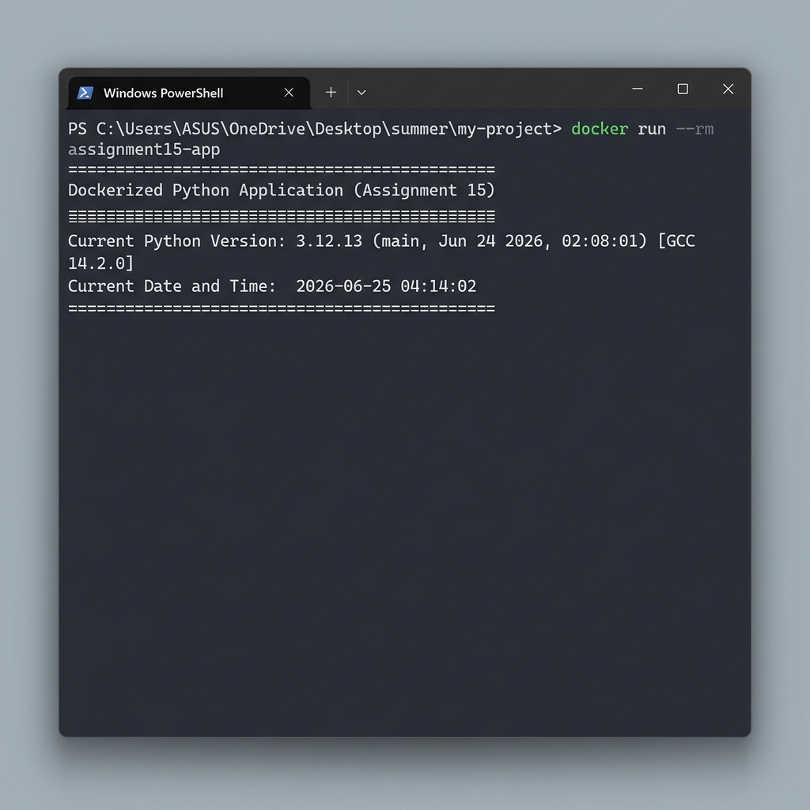

# Assignment 15: Dockerized Python Application

This project contains a Dockerized Python application built as part of Assignment 15. The application runs inside a lightweight Linux container, retrieves the running Python version, and prints it along with the current date and time.

## Project Structure

```
assignment15/
├── Dockerfile              # Instructions to build the Docker image
├── assignment15.py        # Python script that prints version and timestamp
├── requirements.txt       # Dependencies file (empty as only standard library is used)
├── README.md               # Documentation and instructions
└── output_screenshot.png  # Screenshot of the terminal run
```

## Features

- Uses `python:3.12-slim` as the base image for a minimized image size.
- Displays the exact Python version running inside the container.
- Prints the current timestamp formatted as `YYYY-MM-DD HH:MM:SS`.
- Automatically executes the script when the container starts.

---

## Getting Started

### Prerequisites

To build and run this application, you must have the following installed on your machine:
- **Docker**: [Install Docker Desktop](https://www.docker.com/products/docker-desktop/)
- **Git**: [Install Git](https://git-scm.com/) (to clone the repository)

### Steps to Run

#### 1. Clone the Repository
Clone the repository to your local machine and navigate into the `assignment15` directory:
```bash
git clone https://github.com/Suraj-jangid121/my-project.git
cd my-project/assignment15
```

#### 2. Build the Docker Image
Build the Docker image locally using the `Dockerfile` with the tag `assignment15-app`:
```bash
docker build -t assignment15-app .
```

#### 3. Run the Docker Container
Run the built container. The `--rm` flag ensures that the container is automatically removed once it exits:
```bash
docker run --rm assignment15-app
```

---

## Sample Output

When executed successfully, the container produces the following terminal output:

```
==================================================
Dockerized Python Application (Assignment 15)
==================================================
Current Python Version: 3.12.13 (main, Jun 24 2026, 02:08:01) [GCC 14.2.0]
Current Date and Time:  2026-06-25 04:14:02
==================================================
```

### Output Screenshot

Below is a screenshot demonstrating the Docker build and run commands executed in a terminal:


