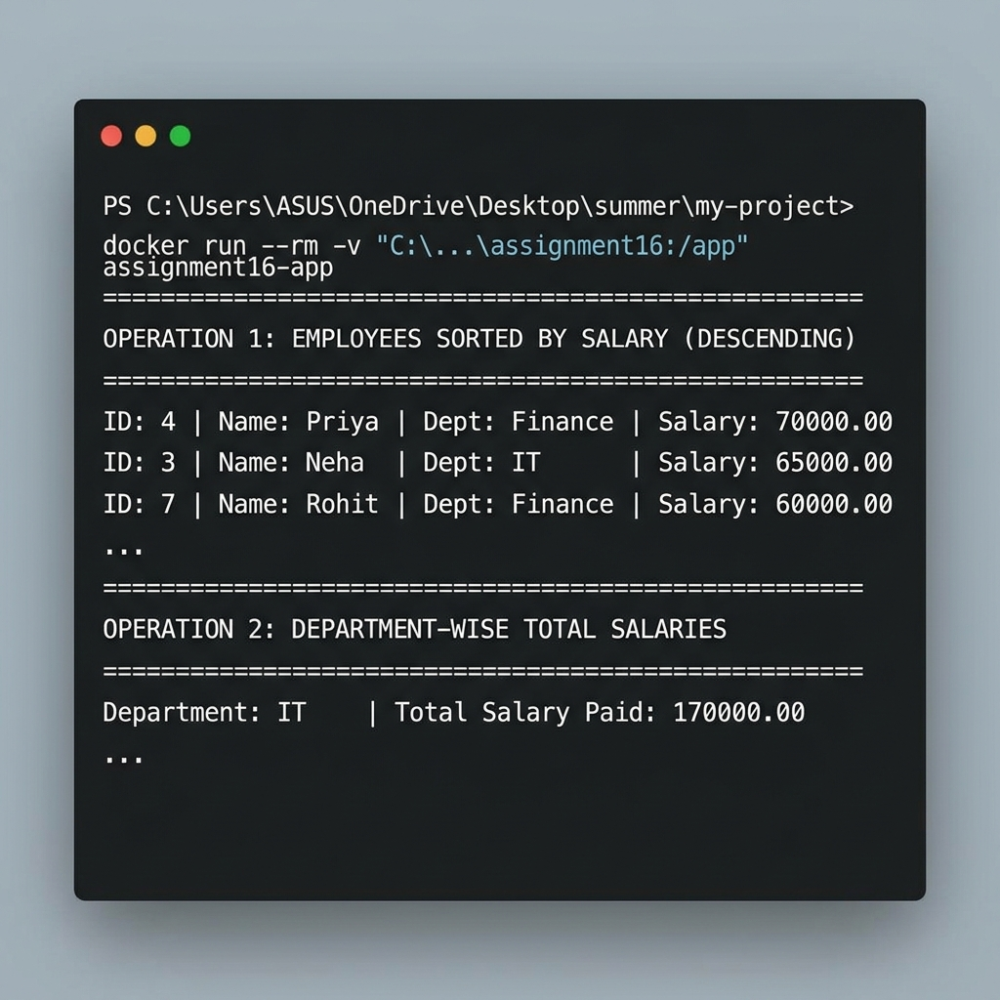

# Assignment 16: PySpark Employee Salary RDD Processor

This project is a Dockerized PySpark application that processes an employee dataset using PySpark RDDs (Resilient Distributed Datasets). The application reads a CSV file containing employee records and performs key data processing operations such as sorting, aggregation (department-wise totals), and filtering top records.

## Project Structure

```
assignment16/
├── Dockerfile                  # Builds PySpark runtime with Python and Java JRE
├── assignment16.py            # Python PySpark script executing RDD operations
├── employee.csv                # Pasted input CSV dataset
├── requirements.txt           # Python dependencies (pyspark)
├── top_three_employees.txt    # Output file containing the top 3 earners (generated)
├── output_screenshot.png      # Screenshot of the terminal run execution
└── README.md                   # Documentation and instructions
```

## Dataset

The employee dataset is formatted as `id,name,department,salary` and contains the following records:
```csv
id,name,department,salary
1,Amit,IT,55000
2,Rahul,HR,40000
3,Neha,IT,65000
4,Priya,Finance,70000
5,Karan,IT,50000
6,Simran,HR,45000
7,Rohit,Finance,60000
```

## Spark RDD Operations

The PySpark script performs the following core RDD-level operations:
1. **Sorting**: Sorts all employees by salary in descending order and prints the results to the console.
2. **Aggregation**: Calculates the total salary paid in each department using `map` and `reduceByKey`, then outputs the department-wise totals.
3. **Filtering & File Output**: Extracts the top three highest-paid employees using `take(3)` on the sorted dataset and writes the formatted result to a file (`top_three_employees.txt`).

---

## Getting Started

### Prerequisites

You need the following software installed:
- **Docker Desktop**: [Download and Install](https://www.docker.com/products/docker-desktop/)
- **Git**: [Download and Install](https://git-scm.com/)

---

### Steps to Build and Run

#### 1. Clone and Navigate
Clone the repository and go to the `assignment16` directory:
```bash
git clone https://github.com/Suraj-jangid121/my-project.git
cd my-project/assignment16
```

#### 2. Build the Docker Image
The `Dockerfile` sets up Python 3.12, installs OpenJDK Runtime, and pulls PySpark. Build the image:
```bash
docker build -t assignment16-app .
```

#### 3. Run the Container and Save Outputs to Host
To ensure the container executes Spark and saves the output file (`top_three_employees.txt`) back to your host folder, run the container with a local directory volume mount:

**On Windows (PowerShell):**
```powershell
docker run --rm -v "${pwd}:/app" assignment16-app
```

**On Linux / macOS:**
```bash
docker run --rm -v "$(pwd):/app" assignment16-app
```

---

## Sample Console Output

Upon starting, the container prints the results of the RDD computations:

```
============================================================
OPERATION 1: EMPLOYEES SORTED BY SALARY (DESCENDING)
============================================================
ID: 4  | Name: Priya      | Dept: Finance    | Salary: 70000.00
ID: 3  | Name: Neha       | Dept: IT         | Salary: 65000.00
ID: 7  | Name: Rohit      | Dept: Finance    | Salary: 60000.00
ID: 1  | Name: Amit       | Dept: IT         | Salary: 55000.00
ID: 5  | Name: Karan      | Dept: IT         | Salary: 50000.00
ID: 6  | Name: Simran     | Dept: HR         | Salary: 45000.00
ID: 2  | Name: Rahul      | Dept: HR         | Salary: 40000.00
============================================================

============================================================
OPERATION 2: DEPARTMENT-WISE TOTAL SALARIES
============================================================
Department: IT         | Total Salary Paid: 170000.00
Department: HR         | Total Salary Paid: 85000.00
Department: Finance    | Total Salary Paid: 130000.00
============================================================

============================================================
OPERATION 3: TOP 3 HIGHEST-PAID EMPLOYEES
============================================================
ID: 4  | Name: Priya      | Dept: Finance    | Salary: 70000.00
ID: 3  | Name: Neha       | Dept: IT         | Salary: 65000.00
ID: 7  | Name: Rohit      | Dept: Finance    | Salary: 60000.00
============================================================
Output successfully saved to: top_three_employees.txt
```

### Execution Screenshot

Below is a visual of the execution inside the terminal:


