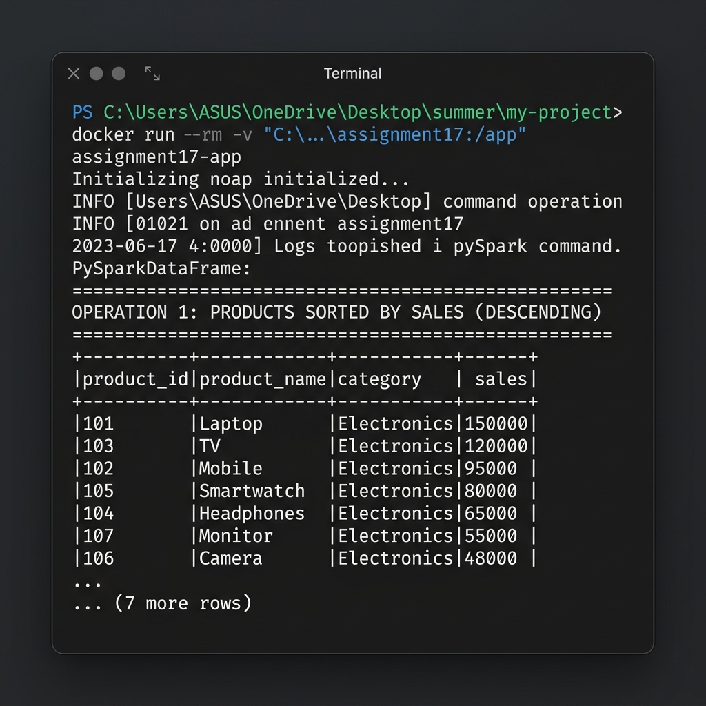

# Assignment 17: PySpark Product Sales DataFrame Processor

This project is a Dockerized PySpark application that processes a sales dataset using PySpark DataFrames. The application reads a CSV file containing product sales records and performs various data manipulation tasks such as sorting, selecting top records, and filtering values to export to a separate CSV.

## Project Structure

```
assignment17/
├── Dockerfile                  # Builds PySpark runtime with Python and Java JRE
├── assignment17.py            # Python PySpark script executing DataFrame operations
├── sales.csv                   # Pasted input CSV dataset
├── requirements.txt           # Python dependencies (pyspark)
├── high_sales_products.csv    # Output file containing products with sales > 80k (generated)
├── output_screenshot.png      # Screenshot of the terminal run execution
└── README.md                   # Documentation and instructions
```

## Dataset

The product sales dataset is formatted as `product_id,product_name,category,sales` and contains the following records:
```csv
product_id,product_name,category,sales
101,Laptop,Electronics,150000
102,Mobile,Electronics,95000
103,TV,Electronics,120000
104,Chair,Furniture,30000
105,Table,Furniture,45000
106,Sofa,Furniture,80000
107,Headphones,Electronics,25000
108,Bed,Furniture,90000
```

## Spark DataFrame Operations

The PySpark script performs the following core DataFrame-level operations:
1. **Sorting**: Sorts all products by sales in descending order and displays the results to the console.
2. **Top Records**: Displays the top 3 products with the highest sales values.
3. **Filtering & File Output**: Filters products with sales greater than 80,000 and writes the output as a clean single CSV file (`high_sales_products.csv`).

---

## Getting Started

### Prerequisites

You need the following software installed:
- **Docker Desktop**: [Download and Install](https://www.docker.com/products/docker-desktop/)
- **Git**: [Download and Install](https://git-scm.com/)

---

### Steps to Build and Run

#### 1. Clone and Navigate
Clone the repository and go to the `assignment17` directory:
```bash
git clone https://github.com/Suraj-jangid121/my-project.git
cd my-project/assignment17
```

#### 2. Build the Docker Image
The `Dockerfile` sets up Python 3.12, installs OpenJDK Runtime, and pulls PySpark. Build the image:
```bash
docker build -t assignment17-app .
```

#### 3. Run the Container and Save Outputs to Host
To ensure the container executes Spark and saves the output file (`high_sales_products.csv`) back to your host folder, run the container with a local directory volume mount:

**On Windows (PowerShell):**
```powershell
docker run --rm -v "${pwd}:/app" assignment17-app
```

**On Linux / macOS:**
```bash
docker run --rm -v "$(pwd):/app" assignment17-app
```

---

## Sample Console Output

Upon starting, the container prints the results of the DataFrame computations:

```
DataFrame Schema:
root
 |-- product_id: integer (nullable = true)
 |-- product_name: string (nullable = true)
 |-- category: string (nullable = true)
 |-- sales: integer (nullable = true)

================================================================================
OPERATION 1: PRODUCTS SORTED BY SALES (DESCENDING)
================================================================================
+----------+------------+-----------+------+
|product_id|product_name|category   |sales |
+----------+------------+-----------+------+
|101       |Laptop      |Electronics|150000|
|103       |TV          |Electronics|120000|
|102       |Mobile      |Electronics|95000 |
|108       |Bed         |Furniture  |90000 |
|106       |Sofa        |Furniture  |80000 |
|105       |Table       |Furniture  |45000 |
|104       |Chair       |Furniture  |30000 |
|107       |Headphones  |Electronics|25000 |
+----------+------------+-----------+------+

================================================================================
OPERATION 2: TOP 3 PRODUCTS WITH HIGHEST SALES
================================================================================
+----------+------------+-----------+------+
|product_id|product_name|category   |sales |
+----------+------------+-----------+------+
|101       |Laptop      |Electronics|150000|
|103       |TV          |Electronics|120000|
|102       |Mobile      |Electronics|95000 |
+----------+------------+-----------+------+

================================================================================
OPERATION 3: FILTER PRODUCTS WITH SALES > 80,000
================================================================================
+----------+------------+-----------+------+
|product_id|product_name|category   |sales |
+----------+------------+-----------+------+
|101       |Laptop      |Electronics|150000|
|102       |Mobile      |Electronics|95000 |
|103       |TV          |Electronics|120000|
|108       |Bed         |Furniture  |90000 |
+----------+------------+-----------+------+

Output successfully saved as a CSV file to: high_sales_products.csv
```

### Execution Screenshot

Below is a visual of the execution inside the terminal:


