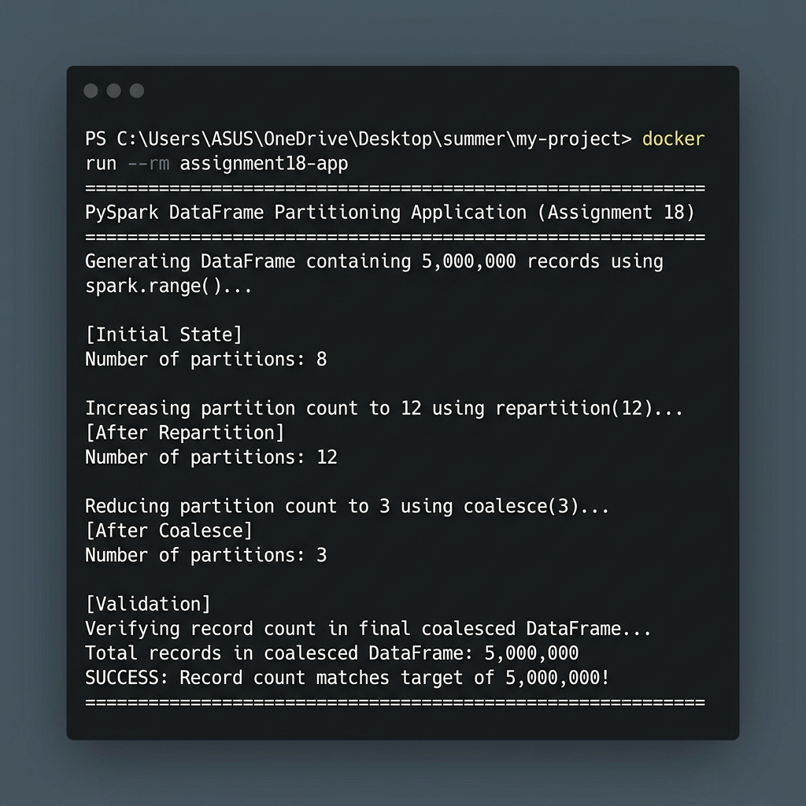

# Assignment 18: PySpark DataFrame Partitioning (Repartition & Coalesce)

This project contains a Dockerized PySpark application that demonstrates DataFrame partition management. The application generates 5 million records using `spark.range()`, inspects its default partition count, repartitions it to a higher count (12) using `repartition()`, and then reduces it to a lower count (3) using `coalesce()`.

## Project Structure

```
assignment18/
├── Dockerfile                  # Builds PySpark runtime with Python and Java JRE
├── assignment18.py            # Python PySpark script executing partition changes
├── requirements.txt           # Python dependencies (pyspark)
├── output_screenshot.png      # Screenshot of the terminal run execution
└── README.md                   # Documentation and instructions
```

## Spark Partitioning Operations

In Apache Spark, partitioning controls how data is distributed across nodes in a cluster. This application demonstrates two primary partitioning operations:
1. **`repartition(N)`**: Increases the number of partitions. This performs a full shuffle of the data across the network to distribute rows evenly.
2. **`coalesce(N)`**: Decreases the number of partitions. This reduces the partition count without a full shuffle by merging existing partitions on the same worker nodes (which is much more efficient than `repartition` for down-sizing).

---

## Getting Started

### Prerequisites

You need the following software installed:
- **Docker Desktop**: [Download and Install](https://www.docker.com/products/docker-desktop/)
- **Git**: [Download and Install](https://git-scm.com/)

---

### Steps to Build and Run

#### 1. Clone and Navigate
Clone the repository and go to the `assignment18` directory:
```bash
git clone https://github.com/Suraj-jangid121/my-project.git
cd my-project/assignment18
```

#### 2. Build the Docker Image
Build the Docker image locally using the `Dockerfile` with the tag `assignment18-app`:
```bash
docker build -t assignment18-app .
```

#### 3. Run the Docker Container
Run the built container:
```bash
docker run --rm assignment18-app
```

---

## Sample Console Output

Upon starting, the container prints the results of the partitioning changes:

```
================================================================================
PySpark DataFrame Partitioning Application (Assignment 18)
================================================================================
Generating DataFrame containing 5,000,000 records using spark.range()...

[Initial State]
Number of partitions: 8

Increasing partition count to 12 using repartition(12)...
[After Repartition]
Number of partitions: 12

Reducing partition count to 3 using coalesce(3)...
[After Coalesce]
Number of partitions: 3

[Validation]
Verifying record count in final coalesced DataFrame...
Total records in coalesced DataFrame: 5,000,000
SUCCESS: Record count matches target of 5,000,000!
================================================================================
```

> [!NOTE]
> The initial partition count defaults to the number of logical CPU cores on the host machine running Spark locally (in local mode `local[*]`). In this run, the host had 8 cores, yielding an initial partition count of 8.

### Execution Screenshot

Below is a visual of the execution inside the terminal:


